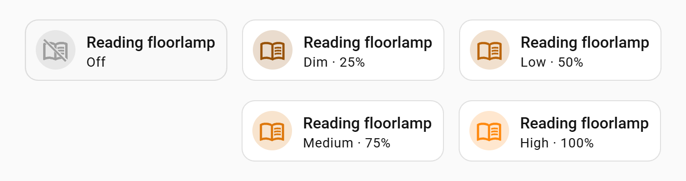

<sub>🇺🇸&nbsp;<a href="README.md">E⁠n⁠g⁠l⁠i⁠s⁠h</a></sub>

<a href="https://www.home-assistant.io/"></a>
<a href="https://hacs.xyz/"></a>
<a href="custom_components/smart_plug_multilevel_light/manifest.json"></a>
<a href="LICENSE"></a>

> Интеграция объединяет обычный светильник и умную розетку в одну сущность Home Assistant. Она определяет состояние и текущий режим яркости по потребляемому току, отображает в карточке и позволяет включить лампу, выключенную собственной кнопкой, кратко отключив и снова подав питание через розетку.
 
# 💡 Smart Plug Multi-Level Light



Некоторые лампы переключают яркость своей кнопкой по кругу и не имеют цифрового управления. Умная розетка может подать или отключить питание, а по потребляемому току можно определить как само состояние лампы, так и её текущий режим.

Интеграция объединяет розетку и датчик тока в одну виртуальную сущность света:

- состояние `on`/`off` определяется по току;
- текущий режим определяется по тому же датчику тока;
- каждому режиму назначается условный процент яркости;
- управление выполняется через обычные действия Home Assistant для сущности `light`.

## ✨ Возможности

- Создаёт штатную сущность Home Assistant `light`.
- Использует только локальные сущности Home Assistant, без внешних облачных сервисов.
- Обновляет состояние при изменении розетки или датчика тока — polling не используется.
- Определяет физическое состояние лампы отдельно от состояния розетки.
- Использует один датчик тока и для ON/OFF, и для определения режима яркости.
- Поддерживает любое количество именованных режимов яркости.
- Автоматически сортирует режимы по порогу тока.
- Показывает текущий режим, измеренный ток и условный процент яркости в атрибутах сущности.
- Выполняет power cycle, когда розетка включена, но физическая лампа выключена.
- Содержит Lovelace-карточку на базе штатной Tile-карточки и автоматически регистрирует её при стандартном режиме хранения ресурсов.

Интеграция не рисует перечёркивание для OFF-иконок. Для единого глобального поведения можно использовать отдельный проект [MDI Off Fallback](https://github.com/LanKing/ha-mdi-off-fallback).

## 📋 Требования

Умная розетка должна предоставлять в Home Assistant две включённые сущности, принадлежащие одному устройству:

| Назначение | Требование |
|---|---|
| Управление питанием | сущность домена `switch` |
| Измерение тока | сущность `sensor` с `device_class: current` |

При создании helper список розеток ограничивается устройствами, у которых найден датчик тока. После выбора розетки интеграция предлагает только датчики тока, относящиеся к тому же устройству.

> Отдельный датчик мощности больше не требуется: состояние ON/OFF и режим яркости определяются по одному датчику тока.

<a id="installation"></a>
## 📦 Установка

### 🛍 Установка через HACS

ℹ️ [Что такое HACS и как его установить?](https://github.com/LanKing/ha-tools/blob/main/appendix-what-is-hacs/docs/README_ru.md)

#### 1. Добавление репозитория

Пока репозиторий не включён в стандартный каталог HACS, добавьте его как пользовательский:

1. Откройте **HACS → Integrations**.
2. Откройте меню в правом верхнем углу и выберите **Custom repositories**.
3. Добавьте:

```text
https://github.com/LanKing/ha-smart-plug-multilevel-light
```

4. Выберите тип **Integration** и нажмите **Add**.

> Добавление репозитория только делает интеграцию доступной в HACS. Для установки необходимо отдельно открыть её карточку и нажать **Download**.

#### 2. Установка интеграции

1. Найдите в HACS: `Smart Plug Multi-Level Light`.
2. Откройте интеграцию и нажмите **Download**.
3. После установки полностью перезапустите Home Assistant.

<a id="manual-installation"></a>
### 🗂 Установка без HACS

1. На странице репозитория нажмите **Code → Download ZIP**.
2. Распакуйте архив.
3. Скопируйте папку:

```text
custom_components/smart_plug_multilevel_light
```

в каталог конфигурации Home Assistant:

```text
/config/custom_components/smart_plug_multilevel_light
```

Итоговый путь к manifest должен выглядеть так:

```text
/config/custom_components/smart_plug_multilevel_light/manifest.json
```

4. Полностью перезапустите Home Assistant.

> Не копируйте внешнюю папку репозитория целиком в `custom_components`. Внутри `custom_components` должна находиться непосредственно папка `smart_plug_multilevel_light`.

Карточка входит в состав интеграции, поэтому HACS для её установки не требуется. После ручного копирования файлов, перезапуска Home Assistant и создания первого helper интеграция публикует JavaScript-файл карточки и автоматически регистрирует его в Dashboard Resources при стандартном режиме `storage`. В YAML-режиме ресурсов карточку необходимо зарегистрировать вручную, как описано ниже.

## 🚀 Быстрый старт после установки

После установки через HACS или вручную выполните следующие шаги.

1. **Полностью перезапустите Home Assistant.**
2. Откройте **[Settings → Devices & services → Helpers](https://my.home-assistant.io/redirect/helpers/)** и нажмите **Create helper**.
3. Выберите **Smart Plug Multi-Level Light**.
4. Выберите умную розетку, к которой подключена лампа. В списке отображаются только розетки, у которых Home Assistant видит датчик тока в том же устройстве.
5. На следующем шаге задайте параметры лампы:
   - **Name** — имя создаваемой сущности, например `Торшер`;
   - **Current sensor** — датчик тока розетки;
   - **OFF current threshold** — ток, на уровне которого или ниже лампа считается выключенной; по умолчанию `0.005 A`;
   - **Power cycle delay** — пауза между отключением и повторной подачей питания; по умолчанию `0.7 s`;
   - **Brightness modes** — добавьте минимум один режим яркости и соответствующий ему ток.
6. Для каждого режима переключите лампу её физической кнопкой, посмотрите текущее значение датчика тока и внесите его в **Brightness modes**. Например:

   | Режим | Ток |
   |---|---:|
   | Dim | `0.020 A` |
   | Low | `0.025 A` |
   | Medium | `0.030 A` |
   | High | `0.040 A` |

7. Сохраните helper. Home Assistant создаст новую сущность `light`, например `light.torsher`.
8. Откройте нужный Dashboard, включите режим редактирования и нажмите **Add card**.
9. Выберите **Smart Plug Multi-Level Light**, укажите созданную сущность `light` и сохраните карточку.

> В стандартном режиме ресурсов `storage` отдельно добавлять JavaScript-ресурс карточки не нужно: интеграция регистрирует его автоматически после загрузки первого настроенного helper. Если карточка не появилась в списке сразу, обновите страницу Home Assistant.

После настройки проверьте три сценария:

- выключение сущности `light` в Home Assistant должно отключать розетку;
- включение при выключенной розетке должно подавать питание на лампу;
- если розетка включена, но лампа была выключена собственной кнопкой и ток упал до **OFF current threshold** или ниже, команда включения должна кратко отключить розетку, подождать **Power cycle delay** и включить её снова.

## ⚙️ Создание и настройка helper

После перезапуска откройте **[Settings → Devices & services → Helpers](https://my.home-assistant.io/redirect/helpers/)**, нажмите **Create helper** и выберите **Smart Plug Multi-Level Light**.

### Шаг 1. Выбор розетки

Выберите сущность `switch` нужной умной розетки. В списке должны отображаться только розетки, устройство которых также предоставляет датчик тока.

### Шаг 2. Настройка лампы

| Параметр | Назначение | Значение по умолчанию |
|---|---|---:|
| **Name** | имя создаваемой сущности света | `Светильник` |
| **Current sensor** | датчик тока выбранной розетки | выбирается автоматически, если найден один |
| **OFF current threshold** | ток на уровне порога или ниже считается состоянием OFF | `0.005 A` |
| **Power cycle delay** | пауза между выключением и повторным включением розетки | `0.7 s` |
| **Brightness modes** | список названий режимов и соответствующих порогов тока | необходимо добавить минимум один режим |

Все изменяемые параметры, кроме самой розетки, можно позднее отредактировать в настройках созданного helper. Режимы редактируются на одной странице и сохраняются отсортированными по току.

### Как подобрать OFF threshold

При включённой розетке выключите лампу её собственной кнопкой и посмотрите значение датчика тока. **OFF current threshold** должен быть немного выше возможного фонового значения без нагрузки, но заметно ниже тока самого слабого режима.

Например, если выключенная лампа показывает `0–0.002 A`, а самый слабый режим около `0.020 A`, значение `0.005 A` оставляет достаточный запас.

### Как подобрать пороги режимов

1. Включите лампу в первый режим физической кнопкой.
2. Посмотрите текущее значение датчика тока в Home Assistant.
3. Запишите название режима и значение тока.
4. Повторите для каждого режима.
5. Введите значения в таблицу **Brightness modes**.

В подписи поля порога отображается текущее измеренное значение выбранного датчика тока. Это упрощает настройку без перехода на отдельную страницу сущности.

Пример:

| Режим | Порог тока |
|---|---:|
| Dim | `0.020 A` |
| Low | `0.025 A` |
| Medium | `0.030 A` |
| High | `0.040 A` |

Режим выбирается по правилу: используется максимальный настроенный порог, который меньше или равен измеренному току.

При токе `0.028 A` из примера будет выбран режим **Low** с порогом `0.025 A`.

Если измеренный ток выше **OFF current threshold**, но ниже первого порога режима, выбирается первый режим списка.

## 🔌 Как определяется состояние

Виртуальная лампа считается включённой, только когда одновременно выполняются два условия:

1. розетка находится в состоянии `on`;
2. измеренный ток строго выше **OFF current threshold**.

Следовательно, состояние розетки `on` само по себе не означает, что физическая лампа включена. Если лампа выключена собственной кнопкой и ток падает до порога или ниже, виртуальная сущность будет отображаться как `off`, хотя питание на розетке остаётся подано.

Если розетка или датчик тока имеют состояние `unknown`, `unavailable` либо отсутствуют, виртуальная лампа становится недоступной.

## 🎚 Условный процент яркости

Процент рассчитывается не из электрической мощности и не управляет яркостью напрямую. Он определяется позицией режима после сортировки по току.

Например, для четырёх режимов:

| Позиция | Процент |
|---:|---:|
| 1 | `25%` |
| 2 | `50%` |
| 3 | `75%` |
| 4 | `100%` |

Для трёх режимов значения будут приблизительно `33%`, `67%` и `100%`.

Эти проценты используются для отображения режима в карточке и атрибутах сущности. Интеграция не умеет выбрать конкретный режим командой яркости: физическая лампа переключает режимы собственной кнопкой.

## 🕹 Управление лампой

### Включение

Поведение зависит от фактического состояния:

| Исходное состояние | Действие интеграции |
|---|---|
| Розетка `off` | включает розетку |
| Розетка `on`, но ток не выше **OFF current threshold** | выключает розетку, ждёт **Power cycle delay**, затем включает её снова |
| Лампа уже определяется как `on` | ничего не делает |

Power cycle нужен для ламп, которые после краткого отключения питания возвращаются в рабочий режим. Итоговый режим после включения зависит от поведения самой лампы и не задаётся интеграцией.

### Выключение

При выключении виртуальной лампы интеграция вызывает `switch.turn_off` для выбранной розетки.

## 🧩 Lovelace-карточка

Интеграция содержит карточку `custom:smart-plug-multilevel-light-card`, построенную поверх штатной Tile-карточки Home Assistant.

После загрузки первого настроенного helper интеграция:

1. публикует встроенный JavaScript-файл;
2. проверяет Dashboard Resources;
3. в стандартном режиме `storage` автоматически создаёт или обновляет ресурс карточки;
4. добавляет номер версии в URL, чтобы уменьшить проблемы со старым frontend-кэшем.

Это поведение одинаково при установке через HACS и при ручном копировании интеграции: HACS только устанавливает файлы и не участвует в регистрации карточки.

Добавьте карточку через интерфейс Dashboard или YAML:

```yaml
type: custom:smart-plug-multilevel-light-card
entity: light.floor_lamp
```

Доступные параметры:

| Параметр | Тип | По умолчанию | Назначение |
|---|---|---:|---|
| `entity` | string | обязательный | сущность, созданная интеграцией |
| `name` | string | имя сущности | переопределяет имя в карточке |
| `icon` | string | иконка сущности | переопределяет иконку |
| `show_mode` | boolean | `true` | показывает название режима |
| `show_percentage` | boolean | `true` | показывает условный процент |
| `icon_tap_action` | action | `more-info` | дополнительное действие при нажатии на иконку |
| `always_show_icon_background` | boolean | `false` | всегда показывает круглый фон иконки, даже если для `icon_tap_action` выбрано `None` |

Полный пример:

```yaml
type: custom:smart-plug-multilevel-light-card
entity: light.floor_lamp
name: Торшер
icon: mdi:floor-lamp
show_mode: true
show_percentage: true
icon_tap_action:
  action: more-info
always_show_icon_background: false
```

Нажатие на карточку переключает лампу, удержание открывает окно **More info**. Для иконки можно отдельно выбрать действие через **Interactions → Additional icon action**. По умолчанию это **More info**; при выборе **None** иконка перестаёт быть отдельной интерактивной зоной и Home Assistant скрывает круглый фон вокруг неё.

Опция **Always show icon background** позволяет оставить круглый фон видимым постоянно. Это только визуальная настройка: если **Additional icon action** установлено в **None**, фон остаётся, но отдельного действия по нажатию на иконку нет.

Цвет и визуальная интенсивность карточки меняются в зависимости от условного процента, но реальная сущность остаётся обычной ON/OFF-сущностью и не получает команды установки яркости.

### YAML-режим ресурсов Lovelace

Если в `configuration.yaml` явно задано:

```yaml
lovelace:
  resource_mode: yaml
```

Home Assistant не позволяет интеграции автоматически изменить список ресурсов. Добавьте ресурс вручную:

```yaml
lovelace:
  resource_mode: yaml
  resources:
    - url: /api/smart_plug_multilevel_light/smart-plug-multilevel-light-card.js?v=0.6.4
      type: module
```

После изменения перезагрузите ресурсы Lovelace или перезапустите Home Assistant.

## 🔎 Атрибуты сущности

Созданная сущность содержит дополнительные атрибуты:

| Атрибут | Содержимое |
|---|---|
| `mode` | название текущего режима или `Off` |
| `brightness_pct` | условный процент текущего режима |
| `measured_current` | текущее значение датчика тока |
| `configured_modes` | полный отсортированный список режимов с порогами и процентами |

Их можно использовать в шаблонах, автоматизациях и диагностике.

## 🔄 Обновление

### Через HACS

1. Установите доступное обновление в HACS.
2. Полностью перезапустите Home Assistant.
3. Обновите страницу Home Assistant с очисткой кэша, если карточка продолжает выглядеть как старая версия.

При загрузке новой версии интеграция обновляет version query в зарегистрированном URL карточки.

### При ручной установке

1. Скачайте актуальный ZIP репозитория.
2. Замените содержимое:

```text
/config/custom_components/smart_plug_multilevel_light
```

3. Полностью перезапустите Home Assistant.

Существующий helper удалять не нужно: его параметры хранятся в config entry Home Assistant, а не внутри папки интеграции. Для helper, созданного в версии до `0.6.4`, после обновления откройте его настройки и проверьте новый **OFF current threshold**.

## 🧯 Устранение проблем

### Интеграция не появилась в списке helper

**Вероятная причина:** неправильный путь или Home Assistant не был перезапущен.

Проверьте наличие файла:

```text
/config/custom_components/smart_plug_multilevel_light/manifest.json
```

Затем выполните полный перезапуск Home Assistant и проверьте журнал на ошибки `smart_plug_multilevel_light`.

### Список розеток пуст

Интеграция показывает только `switch`, устройство которого также предоставляет включённый датчик с `device_class: current`.

Проверьте в **[Settings → Devices & services → Entities](https://my.home-assistant.io/redirect/entities/)**:

- принадлежат ли `switch` и датчик тока одному устройству;
- включён ли датчик тока;
- правильно ли указан его device class;
- имеет ли он числовое состояние.

### Создание прерывается сообщением об отсутствии датчика тока

После выбора розетки интеграция повторно проверяет наличие датчика тока. Ошибка возникает, если датчик был удалён, отключён, перемещён к другому устройству или перестал иметь `device_class: current`.

### Лампа отображается как OFF при включённой розетке

Это ожидаемо, если измеренный ток равен **OFF current threshold** или ниже него. Уменьшите порог либо проверьте показания датчика тока.

### Лампа отображается как ON, когда физически выключена

Увеличьте **OFF current threshold** так, чтобы он был выше фонового тока при выключенной лампе, но ниже тока самого слабого режима.

### Определяется неправильный режим

Проверьте фактический ток в атрибуте `measured_current` и сравните его с `configured_modes`. Выбирается последний порог, не превышающий измеренное значение.

Не задавайте пороги как середины диапазонов, если ожидается иное поведение. Каждый порог означает нижнюю границу соответствующего режима.

### Карточка не появилась в списке

Автоматическая регистрация выполняется только после загрузки хотя бы одного настроенного helper и только в режиме ресурсов `storage`. Способ установки интеграции — через HACS или вручную — на это не влияет.

Проверьте **[Settings → Dashboards → Resources](https://my.home-assistant.io/redirect/lovelace_resources/)**. Там должен присутствовать URL:

```text
/api/smart_plug_multilevel_light/smart-plug-multilevel-light-card.js?v=0.6.4
```

В YAML-режиме добавьте ресурс вручную.

### После обновления отображается старая карточка

1. Полностью перезапустите Home Assistant.
2. Обновите страницу с очисткой кэша браузера.
3. Проверьте номер версии в URL ресурса Dashboard.
4. В мобильном приложении полностью закройте и заново откройте frontend.

## 🗑 Удаление

1. Удалите все созданные helper **Smart Plug Multi-Level Light** через **[Settings → Devices & services → Helpers](https://my.home-assistant.io/redirect/helpers/)**.
2. Удалите интеграцию через HACS либо вручную удалите папку:

```text
/config/custom_components/smart_plug_multilevel_light
```

3. Проверьте **[Settings → Dashboards → Resources](https://my.home-assistant.io/redirect/lovelace_resources/)** и вручную удалите ресурс карточки, если он остался:

```text
/api/smart_plug_multilevel_light/smart-plug-multilevel-light-card.js?v=0.6.4
```

4. Полностью перезапустите Home Assistant.
5. При необходимости обновите страницу с очисткой frontend-кэша.

> Интеграция автоматически создаёт и обновляет ресурс карточки, но текущая версия не удаляет его при деинсталляции.

## ⚠️ Ограничения

- Поддерживаются только розетки, представленные сущностью `switch` и имеющие отдельный датчик тока в том же устройстве Home Assistant.
- Значение датчика тока должно быть числовым и фактически выражаться в амперах, соответствующих порогам настройки.
- Состояние и режим определяются только по току; интеграция не знает внутреннее состояние лампы.
- **OFF current threshold** должен быть ниже тока самого слабого режима.
- Процент яркости условный и зависит от количества режимов, а не от реального светового потока.
- Команда установки конкретной яркости или режима не поддерживается.
- После подачи питания итоговый режим зависит от памяти и логики физической лампы.
- Автоматическая регистрация карточки недоступна при `lovelace.resource_mode: yaml`.
- Ресурс карточки необходимо удалить вручную при полном удалении интеграции.

## 📄 Лицензия

Проект распространяется по лицензии [MIT](LICENSE).
