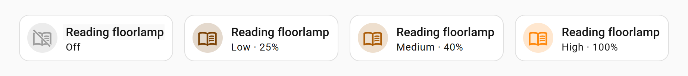
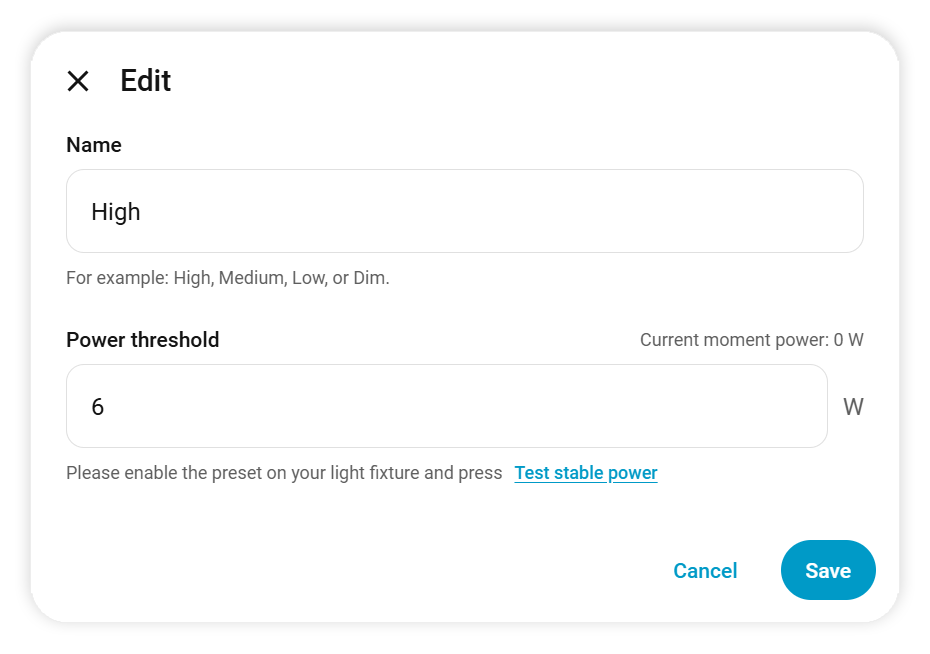
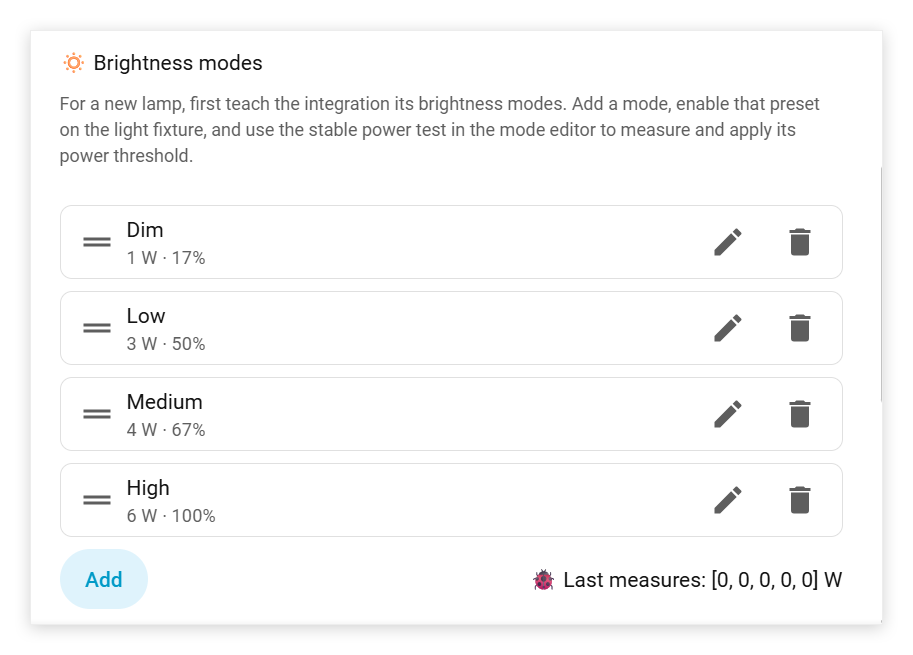

<sub>🇺🇸&nbsp;<a href="../README.md">E⁠n⁠g⁠l⁠i⁠s⁠h</a>&nbsp;|</sub> <sub>🇺🇦&nbsp;<a href="README_uk.md">У⁠к⁠р⁠а⁠ї⁠н⁠с⁠ь⁠к⁠а</a>&nbsp;|</sub> <sub>ru&nbsp;<a href="README_ru.md">Р⁠у⁠с⁠с⁠к⁠и⁠й</a>&nbsp;|</sub> <sub>🇿🇦&nbsp;<a href="README_af.md">A⁠f⁠r⁠i⁠k⁠a⁠a⁠n⁠s</a>&nbsp;|</sub> <sub>🇸🇦&nbsp;<a href="README_ar.md">ا⁠ل⁠ع⁠ر⁠ب⁠ي⁠ة</a>&nbsp;|</sub> <sub>🇧🇬&nbsp;<a href="README_bg.md">Б⁠ъ⁠л⁠г⁠а⁠р⁠с⁠к⁠и</a>&nbsp;|</sub> <sub>🇧🇦&nbsp;<a href="README_bs.md">B⁠o⁠s⁠a⁠n⁠s⁠k⁠i</a>&nbsp;|</sub> <sub>ca&nbsp;<a href="README_ca.md">C⁠a⁠t⁠a⁠l⁠à</a>&nbsp;|</sub> <sub>🇨🇿&nbsp;<a href="README_cs.md">Č⁠e⁠š⁠t⁠i⁠n⁠a</a>&nbsp;|</sub> <sub>cy&nbsp;<a href="README_cy.md">C⁠y⁠m⁠r⁠a⁠e⁠g</a>&nbsp;|</sub> <sub>🇩🇰&nbsp;<a href="README_da.md">D⁠a⁠n⁠s⁠k</a>&nbsp;|</sub> <sub>🇩🇪&nbsp;<a href="README_de.md">D⁠e⁠u⁠t⁠s⁠c⁠h</a>&nbsp;|</sub> <sub>🇬🇷&nbsp;<a href="README_el.md">Ε⁠λ⁠λ⁠η⁠ν⁠ι⁠κ⁠ά</a>&nbsp;|</sub> <sub>eo&nbsp;<a href="README_eo.md">E⁠s⁠p⁠e⁠r⁠a⁠n⁠t⁠o</a>&nbsp;|</sub> <sub>🇪🇸&nbsp;<a href="README_es.md">E⁠s⁠p⁠a⁠ñ⁠o⁠l</a>&nbsp;|</sub> <sub>🇪🇪&nbsp;<a href="README_et.md">E⁠e⁠s⁠t⁠i</a>&nbsp;|</sub> <sub>eu&nbsp;<a href="README_eu.md">E⁠u⁠s⁠k⁠a⁠r⁠a</a>&nbsp;|</sub> <sub>🇮🇷&nbsp;<a href="README_fa.md">ف⁠ا⁠ر⁠س⁠ی</a>&nbsp;|</sub> <sub>🇫🇮&nbsp;<a href="README_fi.md">S⁠u⁠o⁠m⁠i</a>&nbsp;|</sub> <sub>fy&nbsp;<a href="README_fy.md">F⁠r⁠y⁠s⁠k</a>&nbsp;|</sub> <sub>🇫🇷&nbsp;<a href="README_fr.md">F⁠r⁠a⁠n⁠ç⁠a⁠i⁠s</a>&nbsp;|</sub> <sub>🇮🇪&nbsp;<a href="README_ga.md">G⁠a⁠e⁠i⁠l⁠g⁠e</a>&nbsp;|</sub> <sub>gl&nbsp;<a href="README_gl.md">G⁠a⁠l⁠e⁠g⁠o</a>&nbsp;|</sub> <sub>🇨🇭&nbsp;<a href="README_gsw.md">S⁠c⁠h⁠w⁠i⁠i⁠z⁠e⁠r⁠d⁠ü⁠t⁠s⁠c⁠h</a>&nbsp;|</sub> <sub>🇮🇱&nbsp;<a href="README_he.md">ע⁠ב⁠ר⁠י⁠ת</a>&nbsp;|</sub> <sub>🇮🇳&nbsp;<a href="README_hi.md">हि⁠न्दी</a>&nbsp;|</sub> <sub>🇭🇷&nbsp;<a href="README_hr.md">H⁠r⁠v⁠a⁠t⁠s⁠k⁠i</a>&nbsp;|</sub> <sub>🇭🇺&nbsp;<a href="README_hu.md">M⁠a⁠g⁠y⁠a⁠r</a>&nbsp;|</sub> <sub>🇦🇲&nbsp;<a href="README_hy.md">Հ⁠ա⁠յ⁠ե⁠ր⁠ե⁠ն</a>&nbsp;|</sub> <sub>🇮🇩&nbsp;<a href="README_id.md">I⁠n⁠d⁠o⁠n⁠e⁠s⁠i⁠a</a>&nbsp;|</sub> <sub>🇮🇸&nbsp;<a href="README_is.md">Í⁠s⁠l⁠e⁠n⁠s⁠k⁠a</a>&nbsp;|</sub> <sub>🇮🇹&nbsp;<a href="README_it.md">I⁠t⁠a⁠l⁠i⁠a⁠n⁠o</a>&nbsp;|</sub> <sub>🇯🇵&nbsp;<a href="README_ja.md">日⁠本⁠語</a>&nbsp;|</sub> <sub>🇬🇪&nbsp;<a href="README_ka.md">K⁠a⁠r⁠t⁠u⁠l⁠i</a>&nbsp;|</sub> <sub>🇰🇷&nbsp;<a href="README_ko.md">한⁠국⁠어</a>&nbsp;|</sub> <sub>🇱🇺&nbsp;<a href="README_lb.md">L⁠ë⁠t⁠z⁠e⁠b⁠u⁠e⁠r⁠g⁠e⁠s⁠c⁠h</a>&nbsp;|</sub> <sub>🇱🇹&nbsp;<a href="README_lt.md">L⁠i⁠e⁠t⁠u⁠v⁠i⁠ų</a>&nbsp;|</sub> <sub>🇱🇻&nbsp;<a href="README_lv.md">L⁠a⁠t⁠v⁠i⁠e⁠š⁠u</a>&nbsp;|</sub> <sub>🇲🇰&nbsp;<a href="README_mk.md">М⁠а⁠к⁠е⁠д⁠о⁠н⁠с⁠к⁠и</a>&nbsp;|</sub> <sub>🇮🇳&nbsp;<a href="README_ml.md">മ⁠ല⁠യാ⁠ളം</a>&nbsp;|</sub> <sub>🇳🇴&nbsp;<a href="README_nb.md">N⁠o⁠r⁠s⁠k⁠&nbsp;⁠B⁠o⁠k⁠m⁠å⁠l</a>&nbsp;|</sub> <sub>🇳🇱&nbsp;<a href="README_nl.md">N⁠e⁠d⁠e⁠r⁠l⁠a⁠n⁠d⁠s</a>&nbsp;|</sub> <sub>🇳🇴&nbsp;<a href="README_nn.md">N⁠o⁠r⁠s⁠k⁠&nbsp;⁠N⁠y⁠n⁠o⁠r⁠s⁠k</a>&nbsp;|</sub> <sub>🇵🇱&nbsp;<a href="README_pl.md">P⁠o⁠l⁠s⁠k⁠i</a>&nbsp;|</sub> <sub>🇵🇹&nbsp;<a href="README_pt.md">P⁠o⁠r⁠t⁠u⁠g⁠u⁠ê⁠s</a>&nbsp;|</sub> <sub>🇧🇷&nbsp;<a href="README_pt-BR.md">P⁠o⁠r⁠t⁠u⁠g⁠u⁠ê⁠s⁠&nbsp;⁠(⁠B⁠R⁠)</a>&nbsp;|</sub> <sub>🇷🇴&nbsp;<a href="README_ro.md">R⁠o⁠m⁠â⁠n⁠ă</a>&nbsp;|</sub> <sub>🇸🇰&nbsp;<a href="README_sk.md">S⁠l⁠o⁠v⁠e⁠n⁠č⁠i⁠n⁠a</a>&nbsp;|</sub> <sub>🇸🇮&nbsp;<a href="README_sl.md">S⁠l⁠o⁠v⁠e⁠n⁠š⁠č⁠i⁠n⁠a</a>&nbsp;|</sub> <sub>🇦🇱&nbsp;<a href="README_sq.md">S⁠h⁠q⁠i⁠p</a>&nbsp;|</sub> <sub>🇷🇸&nbsp;<a href="README_sr.md">С⁠р⁠п⁠с⁠к⁠и</a>&nbsp;|</sub> <sub>🇷🇸&nbsp;<a href="README_sr-Latn.md">S⁠r⁠p⁠s⁠k⁠i</a>&nbsp;|</sub> <sub>🇸🇪&nbsp;<a href="README_sv.md">S⁠v⁠e⁠n⁠s⁠k⁠a</a>&nbsp;|</sub> <sub>🇮🇳&nbsp;<a href="README_ta.md">த⁠மி⁠ழ்</a>&nbsp;|</sub> <sub>🇮🇳&nbsp;<a href="README_te.md">తె⁠లు⁠గు</a>&nbsp;|</sub> <sub>🇹🇭&nbsp;<a href="README_th.md">ภ⁠า⁠ษ⁠า⁠ไ⁠ท⁠ย</a>&nbsp;|</sub> <sub>🇹🇷&nbsp;<a href="README_tr.md">T⁠ü⁠r⁠k⁠ç⁠e</a>&nbsp;|</sub> <sub>🇵🇰&nbsp;<a href="README_ur.md">اُ⁠ر⁠دُ⁠و</a>&nbsp;|</sub> <sub>🇻🇳&nbsp;<a href="README_vi.md">T⁠i⁠ế⁠n⁠g⁠&nbsp;⁠V⁠i⁠ệ⁠t</a>&nbsp;|</sub> <sub>🇨🇳&nbsp;<a href="README_zh-Hans.md">简⁠体⁠中⁠文</a>&nbsp;|</sub> <sub>🇹🇼&nbsp;<a href="README_zh-Hant.md">繁⁠體⁠中⁠文</a></sub>

<!-- markdown-translator:f30c10bb91a0f6587cd22ee0c70aa5e504b1807979a245dd1c91d57aadca6019 -->
<a href="https://www.home-assistant.io/"></a> <a href="https://hacs.xyz/"></a> <a href="https://github.com/LanKing/ha-smart-plug-multilevel-light/releases"></a> <a href="https://github.com/LanKing/ha-smart-plug-multilevel-light/releases"></a> <a href="../LICENSE"></a> <a href="https://github.com/sponsors/LanKing"></a>

> ইন্টিগ্রেশন একটি অ-ডিজিটাল কন্ট্রোল লাইট এবং একটি স্মার্ট প্লাগকে একটি সত্তার সাথে একত্রিত করে Home Assistant. এটি পাওয়ার ব্যবহারের উপর ভিত্তি করে স্থিতি এবং বর্তমান উজ্জ্বলতা মোড নির্ধারণ করে, একটি কার্ডে সেগুলি প্রদর্শন করে এবং আপনাকে আউটলেটের মাধ্যমে সংক্ষিপ্তভাবে বন্ধ করে এবং পুনরায় প্রয়োগ করে নিজস্ব বোতাম দ্বারা বন্ধ করা একটি বাতি চালু করার অনুমতি দেয়।

# 🔌 Smart Plug Multi-Level Light



**✨ বৈশিষ্ট্য এবং বৈশিষ্ট্য:**

* একটি নিয়মিত সত্তা তৈরি করে Home Assistant `light`অটোমেশন, স্ক্রিপ্ট এবং স্ট্যান্ডার্ড HA ইন্টারফেসের সাথে সামঞ্জস্যপূর্ণ;
* কীভাবে এটি বন্ধ করা হয়েছিল তা নির্বিশেষে সঠিকভাবে বাতিটি চালু করে: যদি স্মার্ট সকেটের মাধ্যমে শক্তি বন্ধ করা হয় তবে এটি কেবল এটি চালু করে; সকেট চালু থাকার সময় যদি বাতিটি তার নিজস্ব বোতাম দিয়ে বন্ধ করা হয়, তবে এটি ডি-এনার্জাইজিং এবং আবার চালু করার একটি চক্র সঞ্চালন করে;
* প্রকৃতপক্ষে পরিমাপিত স্থিতিশীল শক্তির উপর ভিত্তি করে স্বয়ংক্রিয়ভাবে ল্যাম্পের বর্তমান অপারেটিং মোড নির্ধারণ করে;
* এটিতে একটি সাধারণ কনফিগারার রয়েছে যেখানে ব্যবহারকারী তার ল্যাম্প দ্বারা সমর্থিত মোডগুলির নাম ক্রমানুসারে রাখে এবং সিস্টেমটি প্রতিটি মোডে স্থিতিশীল শক্তি নির্ধারণ করে শেখে;
* প্রথম সেটিং চলাকালীন, পাওয়ার রিয়েল টাইমে পড়া হয়: ব্যবহারকারীকে শুধুমাত্র পরবর্তী মোডে আলো স্যুইচ করতে হবে এবং শেখার বোতাম টিপুন;
* অস্থির পাওয়ার রিডিং সফলভাবে ফিল্টার করে, কার্ডে সূচকের বিশৃঙ্খল পরিবর্তন প্রতিরোধ করে যখন একটি মোডের মধ্যে পাওয়ার "জাম্প" হয় (এবং এমনকি পরবর্তী মোডের সাথে মিলে যায়);
* একটি নির্বিচারে সংখ্যা মোড সমর্থন করে;
* কার্ডটি স্ট্যান্ডার্ডের উপরে নির্মিত Home Assistant টাইল কার্ড এর জ্যামিতি, পটভূমি, হোভার প্রভাব, আকার, টাইপোগ্রাফি এবং স্ট্যান্ডার্ড অ্যাকশন সংরক্ষণ করে;
* কার্ডে, বর্তমান উজ্জ্বলতা দৃশ্যত রঙের তীব্রতা দ্বারা এনকোড করা হয়;
* সর্বাধিক শক্তির তুলনায় রৈখিকভাবে উজ্জ্বলতা গণনা করে; শতাংশের আরও নির্ভুল প্রদর্শনের জন্য গণনাকৃত উজ্জ্বলতাকে 5% এ রাউন্ডিং সক্ষম করা যেতে পারে;
* আপনাকে নমনীয়ভাবে প্রদর্শিত প্যারামিটার এবং কার্ডের চেহারা কাস্টমাইজ করার অনুমতি দেয়;
* আপনাকে শুধুমাত্র নির্বাচিত স্মার্ট প্লাগের সাথে সম্পর্কিত পাওয়ার সেন্সর নির্বাচন করতে দেয়;
* আপনাকে বিভিন্ন মডেলের ল্যাম্প এবং সকেটগুলির সাথে সঠিক অপারেশনের জন্য ডি-এনার্জাইজেশন চক্রের বিলম্ব সামঞ্জস্য করতে দেয়;
* আপনাকে পাওয়ার থ্রেশহোল্ড সেট করতে দেয় যার নীচে বাতি বন্ধ বলে মনে করা হয়;
* ইন্টারফেস 64টি লোকেলের জন্য স্থানীয়করণ করা হয়েছে Home Assistant.

## 🗜 লোহা প্রস্তুত করা

আপনার প্রয়োজন হবে:

1. একটি স্মার্ট সকেট যা HA কে পাওয়ার কন্ট্রোল (সুইচ) এবং পাওয়ার পরিমাপ (ডিভাইস\_ক্লাস: পাওয়ার সহ সেন্সর) প্রদান করবে। উভয় সত্তা একই ডিভাইসের অন্তর্গত এবং সক্ষম হতে হবে।
2. একটি নির্বোধ আলো যা একবার প্লাগ ইন করা হলে স্বয়ংক্রিয়ভাবে চালু হয় এবং সম্পূর্ণ উপভোগের জন্য একাধিক উজ্জ্বলতার সেটিংস রয়েছে৷

> আমি একটি সকেট ব্যবহার করেছি [Tuya TS011F (গিরিয়ের ক্ষেত্রে)](https://www.zigbee2mqtt.io/devices/TS011F_plug_3.html). আমি বলব যে পরীক্ষার শুরুতে, গিয়ারের সিরিজের সকেটগুলি ভুল পরিমাপের কারণে ফিট হয়নি, তবে এই মডেলটি করেছে, যদিও এটি গিয়ারের ক্ষেত্রেও ছিল।

### 👨‍🔬 গুরুত্বপূর্ণ সেটিং যা আমি আমার আউটলেটে প্রয়োগ করেছি:

> আমার সকেট স্বয়ংক্রিয়ভাবে HA-তে রিডিং রিপোর্ট করে না এবং শুধুমাত্র একটি নির্দিষ্ট ব্যবধানে ভোটগ্রহণের অনুমতি দেয়। ডিফল্টরূপে এটি 60 সেকেন্ড ছিল। এই ব্যবধানটি 1 সেকেন্ডে সেট করা প্রয়োজন, অন্যথায় আপনি মোড স্যুইচিং ডিসপ্লে প্রদর্শিত হওয়ার জন্য খুব দীর্ঘ সময় অপেক্ষা করবেন।

এই বিবরণ শুধুমাত্র মাধ্যমে সংযুক্ত সকেট মালিকদের জন্য প্রাসঙ্গিক Z2M. অন্যান্য ব্যবহারকারীদের তাদের কনফিগারেশনের মধ্যে রিফ্রেশ হার সামঞ্জস্য করা উচিত:

1. খোলা **Home Assistant → Zigbee2MQTT**. যদি Zigbee2MQTT পাশের মেনুতে অনুপস্থিত, খুলুন **সেটিংস → অ্যাপ্লিকেশন → Zigbee2MQTT → ওয়েব ইন্টারফেস খুলুন**.
2. বিভাগে যান **ডিভাইস**.
3. প্রয়োজনীয় আউটলেট নির্বাচন করুন।
4. ট্যাব খুলুন **সেটিংস (নির্দিষ্ট)**.
5. পরিবর্তন **পরিমাপ পোল ব্যবধান** 1 সেকেন্ডে

<a id="installation"></a>

## 📦 ইনস্টলেশন

### 🛍 এর মাধ্যমে ইনস্টলেশন HACS

ℹ️ [কি হয়েছে HACS এবং কিভাবে এটি ইনস্টল করতে?](https://github.com/LanKing/ha-tools/blob/main/appendix-what-is-hacs/docs/README_bn.md)

🚀 [লিঙ্কে একটি সংগ্রহস্থল যোগ করার চেষ্টা করুন](https://my.home-assistant.io/redirect/hacs_repository/?owner=LanKing&repository=ha-smart-plug-multilevel-light&category=integration). আপনার HA এই পদ্ধতি সমর্থন করে, ক্লিক করুন **যোগ করুন** খোলে উইন্ডোতে এবং তারপর বোতাম **ডাউনলোড করুন** নীচের ডান কোণে। ইনস্টলেশন সফলভাবে সম্পন্ন হলে, আপনি পরবর্তী পদক্ষেপগুলি এড়িয়ে যেতে পারেন। সরাসরি বিভাগে এড়িয়ে যান [দ্রুত শুরু](#getting-started).

#### 1. একটি সংগ্রহস্থল যোগ করা

সংগ্রহস্থলটি এখনও স্ট্যান্ডার্ড ডিরেক্টরিতে অন্তর্ভুক্ত করা হয়নি HACS, এটি কাস্টম হিসাবে যোগ করুন:

1. খোলা **HACS → ইন্টিগ্রেশন**.
2. উপরের ডান কোণায় মেনু খুলুন এবং নির্বাচন করুন **কাস্টম সংগ্রহস্থল**.
3. যোগ করুন:

```text
https://github.com/LanKing/ha-smart-plug-multilevel-light
```

4. প্রকার নির্বাচন করুন **ইন্টিগ্রেশন** এবং টিপুন **যোগ করুন**.

> একটি সংগ্রহস্থল যোগ করা শুধুমাত্র ইন্টিগ্রেশন উপলব্ধ করে তোলে HACS. ইনস্টল করার জন্য, আপনাকে আলাদাভাবে এর কার্ড খুলতে হবে এবং ক্লিক করতে হবে **ডাউনলোড করুন**.

#### 2. ইন্টিগ্রেশন ইনস্টলেশন

1. মধ্যে খুঁজুন HACS: Smart Plug Multi-Level Light.
2. ইন্টিগ্রেশন খুলুন এবং ক্লিক করুন **ডাউনলোড করুন**.
3. ইনস্টলেশনের পরে, সম্পূর্ণরূপে পুনরায় চালু করুন Home Assistant.

<a id="manual-installation"></a>

### 🧑‍💻 ইনস্টলেশন ছাড়া HACS

1. সংগ্রহস্থল পৃষ্ঠায়, ক্লিক করুন **কোড → জিপ ডাউনলোড করুন**.
2. সংরক্ষণাগার আনপ্যাক.
3. ফোল্ডার কপি করুন:

```text
custom_components/smart_plug_multilevel_light
```

কনফিগারেশন ডিরেক্টরিতে Home Assistant:

```text
/config/custom_components/smart_plug_multilevel_light
```

চূড়ান্ত ফাইল পাথ `manifest.json` এই মত দেখতে হবে:

```text
/config/custom_components/smart_plug_multilevel_light/manifest.json
```

4. সম্পূর্ণরূপে পুনরায় চালু করুন Home Assistant.

> সম্পূর্ণ বহিরাগত সংগ্রহস্থল ফোল্ডার কপি করবেন না `custom_components`. ভিতরে `custom_components` ফোল্ডারটি সরাসরি অবস্থিত হওয়া আবশ্যক `smart_plug_multilevel_light`.

কার্ড ইন্টিগ্রেশন অংশ, তাই HACS এটি ইনস্টলেশনের জন্য প্রয়োজন হয় না। ম্যানুয়ালি ফাইল কপি করার পর, রিস্টার্ট হচ্ছে Home Assistant এবং প্রথম অক্জিলিয়ারী অবজেক্ট তৈরি করে, ইন্টিগ্রেশন জাভাস্ক্রিপ্ট কার্ড ফাইল প্রকাশ করে এবং স্বয়ংক্রিয়ভাবে স্ট্যান্ডার্ড মোডে প্যানেল সংস্থানগুলির সাথে এটি নিবন্ধন করে `storage`. YAML রিসোর্স মোডে, কার্ডটি অবশ্যই ম্যানুয়ালি নিবন্ধিত হতে হবে, যেমন নীচে বর্ণনা করা হয়েছে।

<a id="getting-started"></a>

## 🚀 ইনস্টলেশনের পরে দ্রুত শুরু

### 🛠 কনফিগারেশন

1. খোলা **[সেটিংস → ডিভাইস এবং পরিষেবা → আনুষাঙ্গিক](https://my.home-assistant.io/redirect/helpers/)** এবং টিপুন **হেল্পার অবজেক্ট তৈরি করুন**.

2. নির্বাচন করুন **Smart Plug Multi-Level Light**.

3. ল্যাম্পটি যে স্মার্ট প্লাগটির সাথে সংযুক্ত তা নির্বাচন করুন। তালিকা শুধুমাত্র সকেট আছে যে দেখায় Home Assistant একই ডিভাইসে পাওয়ার সেন্সর দেখে।

4. পরবর্তী ধাপে, ল্যাম্প প্যারামিটার সেট করুন:
   * **লাইটের নাম (Light name)** — যে সত্তা তৈরি করা হচ্ছে তার নাম, উদাহরণস্বরূপ `FloorLamp`;
   * **Power sensor** - সকেট পাওয়ার সেন্সর;

5. বিভাগে **🔅 উজ্জ্বলতার মোড (🔅 Brightness modes)** ক্লিক করে অন্তত একটি উজ্জ্বলতা মোড যোগ করুন **যোগ করুন**.<br /> <br />
   ল্যাম্পটিকে এর ফিজিক্যাল বোতাম দিয়ে স্যুইচ করুন, মোডের নাম লিখুন এবং শুরু করুন **Test stable power**. একটি স্থিতিশীল মান পাওয়ার পরে, টিপুন **আবেদন করুন**.

6. প্রথম মোড যোগ করার পরে, এই ধাপগুলি পুনরাবৃত্তি করে অবশিষ্ট মোড যোগ করুন। আপনার এমন কিছু দিয়ে শেষ করা উচিত:<br />
   

7. সহায়ক বস্তু সংরক্ষণ করুন. Home Assistant একটি নতুন সত্তা তৈরি করবে `light`, যেমন `light.FloorLamp`.

### 🧩 লাভলেস কার্ড

1. পছন্দসই প্যানেল খুলুন, সম্পাদনা মোড চালু করুন এবং ক্লিক করুন **একটি কার্ড যোগ করুন**.
2. নির্বাচন করুন **Smart Plug Multi-Level Light**, তৈরি সত্তা নির্দিষ্ট করুন `light` এবং কার্ড সংরক্ষণ করুন।

কার্ডটি উপলব্ধগুলির মধ্যে না থাকলে, আপনি ব্যবহার করছেন [লাভলেস রিসোর্স YAML মোড](#yaml-lovelace-mode).

### 🎨 ভিজ্যুয়াল এফেক্ট

#### কার্ডে সেটিংস

প্যানেলটি খুলুন যেখানে কার্ডটি অবস্থিত, সম্পাদনা মোডে যান এবং ক্লিক করুন **সম্পাদনা করুন** পছন্দসই কার্ডে।

বিভাগটি খোলা হচ্ছে **বিষয়বস্তু (Content)**, আপনি উপলব্ধ সেটিংস দেখতে পাবেন:

* **মোডের নাম দেখান (Show mode name)** — বর্তমান মোডের নাম দেখায় বা লুকিয়ে রাখে: উদাহরণস্বরূপ, ম্লান, নিম্ন, মাঝারি বা উচ্চ৷
* **শতাংশ দেখান (Show percentage)** - শতাংশ হিসাবে গণনাকৃত উজ্জ্বলতা দেখায় বা লুকিয়ে রাখে।

বিভাগটি খোলা হচ্ছে **ইন্টারঅ্যাকশন (Interactions)**, আপনি দেখতে পাবেন:

* **সবসময় আইকনের পটভূমি দেখান (Always show icon background)** — আইকনের চারপাশে বৃত্তাকার পটভূমি ধরে রাখে, এমনকি যদি এটির জন্য একটি পৃথক ক্রিয়া নিষ্ক্রিয় করা হয়।

> 🚫 যাইহোক, যদি আপনি, আমার মতো, একটি অ-মানক কার্ড আইকন ব্যবহার করেন এবং এটি বন্ধ করার সময় এটি দৃশ্যমানভাবে ক্রস আউট না হয়, আমি আমার অন্য প্লাগইন সুপারিশ করি - [Mdi বন্ধ ফলব্যাক](https://github.com/LanKing/ha-mdi-off-fallback/blob/main/docs/README_bn.md), যা এই নান্দনিক সমস্যার সমাধান করে।

#### উজ্জ্বলতা 5% পর্যন্ত বৃত্তাকার

খোলা **[সেটিংস → ডিভাইস এবং পরিষেবা → আনুষাঙ্গিক](https://my.home-assistant.io/redirect/helpers/)**, আগে তৈরি সহায়ক বস্তু খুঁজুন **Smart Plug Multi-Level Light** এবং সেটিংস খুলুন। চালু বা বন্ধ করুন **Round brightness to 5% (may look nicer)**.

যখন সেটিং সক্ষম করা থাকে, তখন গণনাকৃত শতাংশকে নিকটতম 5%-এ বৃত্তাকার করা হয়, উদাহরণস্বরূপ: 33% → 35%, 67% → 65%৷

রাউন্ডিং শুধুমাত্র কার্ডের প্রদর্শিত শতাংশ এবং ভিজ্যুয়াল তীব্রতাকে প্রভাবিত করে। বাতির মোড সংজ্ঞা এবং অপারেশন পরিবর্তন হয় না। ডিফল্টরূপে, রাউন্ডিং অক্ষম করা হয়।

## 🧩 লাভলেস কার্ড বিস্তারিত

উপলব্ধ বিকল্প:

| প্যারামিটার | টাইপ | ডিফল্ট | বর্ণনা |
|---|---|---:|---|
| `entity` | string | প্রয়োজনীয় | ইন্টিগ্রেশন দ্বারা সৃষ্ট সত্তা |
| `name` | string | সত্তার নাম | কার্ডে দেখানো নাম ওভাররাইড করে |
| `icon` | string | সত্তা আইকন | আইকন ওভাররাইড করে |
| `show_mode` | boolean | `true` | মোডের নাম দেখায় |
| `show_percentage` | boolean | `true` | সিন্থেটিক শতাংশ দেখায় |
| `icon_tap_action` | action | `more-info` | আইকন ট্যাপ করা হলে অতিরিক্ত ক্রিয়া |
| `always_show_icon_background` | boolean | `false` | সবসময় বৃত্তাকার আইকন ব্যাকগ্রাউন্ড দেখায়, এমনকি যখন None icon_tap_action এর জন্য নির্বাচন করা হয় |

সম্পূর্ণ উদাহরণ:

```yaml
type: custom:smart-plug-multilevel-light-card
entity: light.floor_lamp
name: Торшер
icon: mdi:floor-lamp
show_mode: true
show_percentage: true
icon_tap_action:
  action: more-info
always_show_icon_background: false
```

<a id="yaml-lovelace-mode"></a>

### লাভলেস রিসোর্স YAML মোড

> সম্ভবত, আপনি এই মোড সক্রিয় নেই. যদি কোন সমস্যা না থাকে এবং কার্ড কাজ করে, এই ধাপটি এড়িয়ে যান।

যদি থাকে `configuration.yaml` স্পষ্টভাবে সেট:

```yaml
lovelace:
  resource_mode: yaml
```

Home Assistant ইন্টিগ্রেশনকে স্বয়ংক্রিয়ভাবে সম্পদের তালিকা পরিবর্তন করার অনুমতি দেয় না। এই ক্ষেত্রে, ম্যানুয়ালি সম্পদ যোগ করুন:

```yaml
lovelace:
  resource_mode: yaml
  resources:
    - url: /api/smart_plug_multilevel_light/smart-plug-multilevel-light-card.js?v=0.10.9
      type: module
```

পরিবর্তনের পরে, লাভলেস সংস্থানগুলি পুনরায় লোড করুন বা পুনরায় চালু করুন Home Assistant.

<a id="troubleshooting"></a>

## 🧯 সমস্যা সমাধান

<details>
<summary><b>❓ইন্টিগ্রেশন সাহায্যকারী তালিকায় উপস্থিত হয় না</b></summary>
<br />

**সম্ভাব্য কারণ:** ভুল উপায় বা Home Assistant পুনরায় চালু করা হয়নি।

ফাইলের উপলব্ধতা পরীক্ষা করুন:

```text
/config/custom_components/smart_plug_multilevel_light/manifest.json
```

তারপর হার্ড রিস্টার্ট করুন Home Assistant এবং ত্রুটির জন্য লগ চেক করুন `smart_plug_multilevel_light`.

<hr />
</details>

<details>
<summary><b>❓প্লাগ তালিকা খালি আছে</b></summary>
<br />

ইন্টিগ্রেশন শুধুমাত্র বস্তু দেখায় `switch`একটি অন্তর্ভুক্ত সেন্সর প্রদান করে এমন ডিভাইসগুলির সাথে যুক্ত `device_class: power`.

চেক ইন **[সেটিংস → ডিভাইস এবং পরিষেবা → অবজেক্ট](https://my.home-assistant.io/redirect/entities/)**:

* তারা কি অন্তর্গত `switch` এবং একটি ডিভাইসের জন্য একটি পাওয়ার সেন্সর?
* পাওয়ার সেন্সর কি চালু আছে?
* এটা সঠিকভাবে নির্দিষ্ট করা আছে? `device_class`?
* এটি একটি সংখ্যাসূচক রাষ্ট্র আছে?

<hr />
</details>

<details>
<summary><b>❓একটি অনুপস্থিত পাওয়ার সেন্সর বার্তা দিয়ে সৃষ্টি বন্ধ হয়ে যায়</b></summary>
<br />

একটি আউটলেট নির্বাচন করার পরে, ইন্টিগ্রেশন একটি পাওয়ার সেন্সরের উপস্থিতির জন্য পুনরায় পরীক্ষা করে। সেন্সরটি সরানো, অক্ষম করা, অন্য ডিভাইসে সরানো বা আর না থাকলে ত্রুটি ঘটে `device_class: power`.

<hr />
</details>

<details>
<summary><b>❓প্লাগ চালু থাকার সময় বাতিটি বন্ধ হিসাবে দেখানো হয়</b></summary>
<br />

পাওয়ার সেন্সরের মান পরীক্ষা করুন। ভার্চুয়াল বাতি বন্ধ বলে মনে করা হয় যখন `0 W`; যখন ইতিবাচক, এটি হিসাবে সংজ্ঞায়িত করা উচিত `on`.

<hr />
</details>

<details>
<summary><b>❓বাতিটি শারীরিকভাবে বন্ধ থাকা অবস্থায় অন হিসাবে দেখানো হয়৷</b></summary>
<br />

নির্বাচিত পাওয়ার সেন্সরটি আসলে দেখায় তা পরীক্ষা করুন `0 W`, যখন বাতি তার নিজস্ব বোতাম দ্বারা বন্ধ করা হয়.

<hr />
</details>

<details>
<summary><b>❓ভুল মোড সনাক্ত করা হয়</b></summary>
<br />

চেক করুন **🐞 Last measures** সেটিংস এবং গুণাবলীতে `power_history`, `power_history_modes`, `power_sample_interval_seconds` এবং `selected_power_mode`. `power_history` সর্বশেষ রেকর্ড করা পাওয়ার মান দেখায়, `power_history_modes` — কনফিগার করা থ্রেশহোল্ড অনুযায়ী তাদের প্রত্যেকের জন্য মোড, `power_sample_interval_seconds` পর্যায়ক্রমিক ফিক্সেশনের ব্যবধান, এবং `selected_power_mode` - বর্তমান নিশ্চিত মোড।

<hr />
</details>

<details>
<summary><b>❓মোড পরিবর্তন অবিলম্বে প্রদর্শিত হয় না</b></summary>
<br />

এটি প্রত্যাশিত আচরণ। নকল স্যুইচিং থেকে স্বল্পমেয়াদী শক্তির ওঠানামা প্রতিরোধ করতে, একই নতুন মোডের সাথে সামঞ্জস্যপূর্ণ বেশ কয়েকটি পরপর রিডিংয়ের পরেই ইন্টিগ্রেশন মোড পরিবর্তন করে।

প্রয়োজনীয় সংখ্যক রিডিং প্যারামিটার দ্বারা সেট করা হয় **Consecutive readings to switch** এবং ডিফল্ট `5`. পর্যায়ক্রমিক পরিমাপ প্রতি সেকেন্ডে একবার সঞ্চালিত হয়, এবং সেন্সর অবস্থায় পরিবর্তনগুলি অবিলম্বে প্রক্রিয়া করা হয়। পরীক্ষার সময় যদি মান একটি ভিন্ন মোডের সাথে মিলে যায়, তাহলে কাউন্টডাউন আবার শুরু হয়।

নিশ্চিতকরণ পর্যন্ত, ইন্টিগ্রেশন পূর্ববর্তী মোড বজায় রাখে। এর জন্য ধন্যবাদ, কার্ডটি মধ্যবর্তী মানগুলির কারণে মোডগুলির মধ্যে স্যুইচ করে না যা ল্যাম্পটি স্যুইচ করার সময় ঘটে, এর শক্তি স্থিতিশীল করে বা সেন্সর রিডিংয়ে ছোট ওঠানামা হয়।

রিডিংয়ের সংখ্যা কমানো নতুন মোডের প্রদর্শনের গতি বাড়ায়, কিন্তু শনাক্তকরণকে পাওয়ার ওঠানামার জন্য আরও সংবেদনশীল করে তোলে।

<hr />
</details>

<details>
<summary><b>❓তালিকায় কার্ডটি দেখা যাচ্ছে না</b></summary>
<br />

কমপক্ষে একটি কনফিগার করা হেল্পার অবজেক্ট লোড করার পরে এবং শুধুমাত্র রিসোর্স মোডে স্বয়ংক্রিয় নিবন্ধন ঘটে `storage`. ইন্টিগ্রেশন ইনস্টলেশন পদ্ধতি মাধ্যমে হয় HACS বা ম্যানুয়ালি - এর কোন প্রভাব নেই।

চেক করুন **[সেটিংস → প্যানেল → ⋮ → সম্পদ](https://my.home-assistant.io/redirect/lovelace_resources/)**. URL সেখানে থাকা উচিত:

```text
/api/smart_plug_multilevel_light/smart-plug-multilevel-light-card.js?v=0.10.9
```

YAML মোডে [ম্যানুয়ালি সম্পদ যোগ করুন](#yaml-lovelace-mode).

<hr />
</details>

<details>
<summary><b>❓একটি আপডেটের পরেও পুরানো কার্ডটি প্রদর্শিত হয়</b></summary>
<br />

1. সম্পূর্ণরূপে পুনরায় চালু করুন Home Assistant.
2. আপনার ব্রাউজার ক্যাশে সাফ করতে পৃষ্ঠাটি রিফ্রেশ করুন।
3. প্যানেল রিসোর্স URL-এ সংস্করণ নম্বর পরীক্ষা করুন।
4. মোবাইল অ্যাপ্লিকেশনে, ইন্টারফেসটি সম্পূর্ণভাবে বন্ধ করুন এবং পুনরায় খুলুন।

<hr />
</details>

## 🗑 অপসারণ

1. সমস্ত তৈরি সহায়ক বস্তু মুছুন **Smart Plug Multi-Level Light** মাধ্যমে **[সেটিংস → ডিভাইস এবং পরিষেবা → আনুষাঙ্গিক](https://my.home-assistant.io/redirect/helpers/)**.
2. মাধ্যমে ইন্টিগ্রেশন সরান HACS অথবা ম্যানুয়ালি ফোল্ডার মুছে দিন:

```text
/config/custom_components/smart_plug_multilevel_light
```

3. চেক করুন **[সেটিংস → প্যানেল → ⋮ → সম্পদ](https://my.home-assistant.io/redirect/lovelace_resources/)** এবং ম্যানুয়ালি কার্ড রিসোর্স মুছে ফেলুন যদি এটি থেকে যায়:

```text
/api/smart_plug_multilevel_light/smart-plug-multilevel-light-card.js?v=0.10.9
```

4. সম্পূর্ণরূপে পুনরায় চালু করুন Home Assistant.
5. প্রয়োজন হলে, ইন্টারফেস ক্যাশে সাফ করতে পৃষ্ঠাটি রিফ্রেশ করুন।

## 📄 লাইসেন্স

এই প্রকল্পটি [MIT](../LICENSE) লাইসেন্সের অধীনে বিতরণ করা হয়।

## 👋 আপনার সমর্থন
[যদি এই প্রকল্পটি আপনাকে কিছু সময় বাঁচায়, আপনি আমার পরীক্ষাগুলিকে সমর্থন করতে পারেন।](https://github.com/sponsors/LanKing) (GitHub Sponsors). ☕🔧

<br />

> [!TIP]
> **এই সমাধান মত?** দেখে নিন 🏠 <a href="https://github.com/LanKing/ha-tools/blob/main/docs/README_bn.md">আমার অন্যান্য Home Assistant পণ্য</a>
